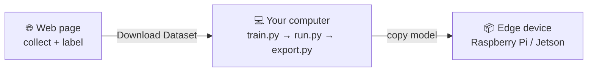

# TESR AI Vision Web Trainer

Train an image-recognition AI **entirely in your browser** — nothing to install,
your photos never leave your computer — then take the *same dataset* to
production-grade YOLO on your PC and deploy it to a Raspberry Pi or NVIDIA Jetson.

**▶ Try it now: https://tesr-channel.github.io/AI_vision_Trainer/**

## What you can build in 10 minutes

- **Object Detection** — draw boxes (straight *or rotated*), the AI finds your
  object and reports its **center position (x, y)** live — the numbers a robot
  arm, conveyor or sorting system needs.
- **Classification** — no boxes at all: the AI names what it sees. The fastest
  path for sorting, go/no-go checks and demos.

Everything runs on WebGL/WebGPU in the page: capture from your webcam, upload
files, auto-augment small datasets, train in seconds, test live, and export.

## Try it

1. Open the page (Chrome/Edge recommended). The UI is **English by default;
   the 🌐 button switches the page to Thai**.
2. Pick a task, add 2+ classes (a "background" class of your empty scene makes
   the "none" answer much more reliable).
3. Hold **Capture** while moving the object around — angle, distance, lighting.
4. Detection: click a photo (or **Label photos**) and drag a box.
   **Scroll / Q / E rotates the box** for tilted objects — it exports as YOLO OBB.
5. **Train**, then **Live Test** with your webcam.
6. **Export** — two downloads, two purposes:
   - **Export Model (.zip)** — the browser model + a ready-to-run Python sample
     (draws box + center), one-click installers, README.
   - **Download Dataset (YOLO)** — your photos + labels, ready for real YOLO training below.

## 🏭 From browser to edge — one path

The in-browser model is great for learning and quick demos, but production wants
YOLO. **Download the dataset and train it offline — same photos, same labels,
one command:**

Train and **export on your computer** (GPU trains in minutes, CPU also works),
then copy the exported model + generated sample code to the device.
`train.py` auto-detects detection / rotated (OBB) / classification from the
dataset itself, and `export.py` writes a `sample_predict.py` you can drop
into any project — plus an MQTT → Node-RED example.

**Full guide: [`yolo-trainer/README.md`](yolo-trainer/README.md)** (English + Thai)

## Honest limits of the in-browser model

The browser trainer uses feature-embedding + a small head — perfect for
learning and prototyping, **one object per frame**, and accuracy below a fully
trained YOLO. When you outgrow it, you don't start over: download the dataset
and train it offline with YOLO — same photos, same labels, one command.

## 🇹🇭 สรุปภาษาไทย (Thai summary)

เทรน AI ตรวจจับ/จำแนกภาพได้ทั้งหมดในเบราว์เซอร์ โดยไม่ต้องติดตั้งอะไรและรูปไม่ออกจากเครื่อง
(กดปุ่ม 🌐 บนหน้าเว็บเพื่อสลับเป็นภาษาไทย)

1. เลือกโหมด: **Detection** (ลากกรอบ หมุนกรอบตามวัตถุเอียงได้ ได้ตำแหน่ง center
   สำหรับหุ่นยนต์/สายพาน) หรือ **Classification** (ไม่ต้องลากกรอบ เร็วที่สุด)
2. ถ่ายรูป + ติด label บนเว็บ → เทรน → ทดสอบสดผ่าน webcam ได้ทันที
3. จะเอาไปใช้จริง: กด **Download Dataset (YOLO)** แล้วเทรนด้วย YOLO
   **บนคอมพิวเตอร์** (`python train.py` — ตรวจโหมดให้อัตโนมัติ รวมกรอบเอียง OBB)
4. Export บนคอมพิวเตอร์ (`python export.py --target pi`) แล้วก๊อปโมเดล +
   sample code ที่ระบบสร้างให้ ไปรันบน Raspberry Pi / Jetson

คู่มือฉบับเต็ม (ไทย/อังกฤษ): [`yolo-trainer/README.md`](yolo-trainer/README.md)

## 📚 Learn more with TESR Academy

This trainer is part of TESR's hands-on AI Vision courses — **Build, Train and
Deploy AI to Edge Devices**: Raspberry Pi, NVIDIA Jetson, industrial cameras,
MQTT/Node-RED integration and Smart Factory solutions.

- 🌐 [tesracademy.com](https://tesracademy.com) · 🛒 [tesrshop.com](https://tesrshop.com)
- Facebook / YouTube: **TESR Channel**

## License

MIT — use it, teach with it, build on it.
