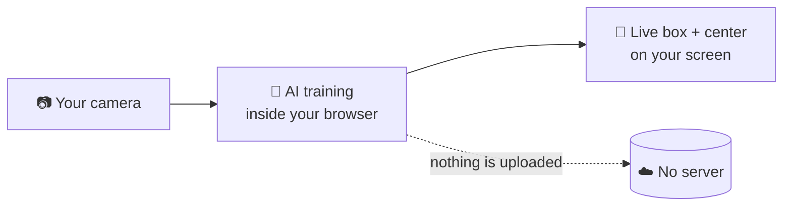
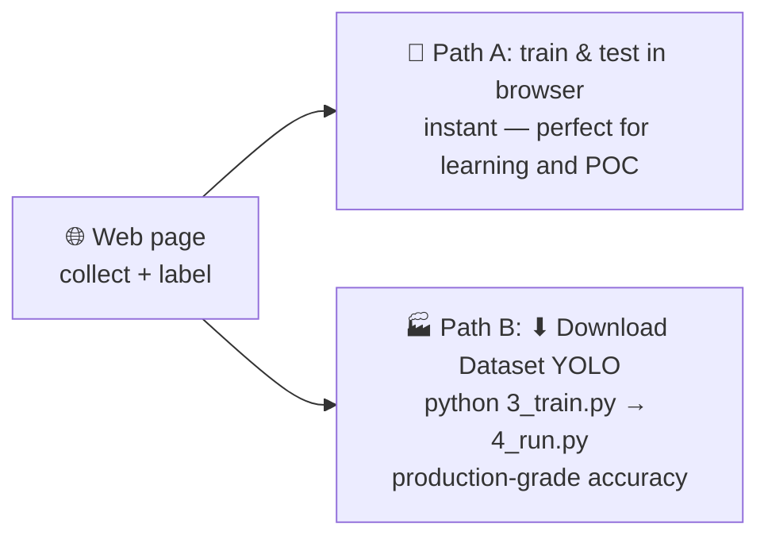
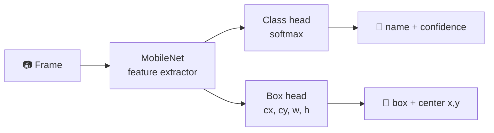

# TESR AI Vision Web Trainer

**Train your own image-recognition AI — right in your browser. Nothing to install.**

Choose your task, show your objects to the camera, draw boxes (detection) or
skip straight to training (classification), and watch the AI work live —
including the object's **center position (x, y)**, the number a robot arm or
conveyor system needs. Everything runs on **your own computer inside the
browser**; your photos never leave your machine.

> 🎓 Built by [TESR — Thai Embedded Systems and Robotics](https://tesrshop.com)
> for makers, students and engineers. *Learn it. Build it. Deploy it. For real.*

---

## ✨ What it does

| | |
|---|---|
| 🧭 **Choose your task** | **Object Detection** (what & where — you draw the boxes) or **Classification** (what is it — fastest, no boxes) |
| 🧩 **Define classes** | e.g. `jetson_board` vs `raspberry_pi` — add a `background` class for best results |
| 📷 **Collect & label** | Hold-to-capture bursts, then draw a tight box on each photo right in the page (red border = needs a box, green = done). Keyboard-fast: Enter = save & next |
| ✨ **Auto augmentation** | ×2–×5 more images in one click — boxes are transformed together with the image |
| 🧠 **Train in seconds** | Transfer learning on your GPU (WebGL/WebGPU); detection trains a classifier + a box model |
| 🎯 **Test live** | **Precise grid scan** finds the object wherever it is (~1 fps) or **Fast** smooth box; crosshair + **center** in pixels on screen |
| 🛡 **Honest "none"** | Two gates (confidence + feature similarity) — an empty scene answers **none**, not a wrong guess |
| 💾 **Export** | One .zip: model + Python sample (draws box & center) + one-click installers + README |
| 🗂 **Dataset export** | One click turns your labeled photos into a ready **YOLO dataset** (images + labels + data.yaml) for offline training |

## 📏 How many photos do I need?

The page tracks this for you, per class, with live ✔/⚠ counters:

| Task | Minimum | Noticeably better |
|---|---|---|
| Object Detection | **40 labeled photos / class** | 80+ |
| Classification | **30 photos / class** | 60+ |

Variety beats quantity: change angle, distance, background and lighting.
For detection, also **move the object around the frame** while capturing —
corners, edges, near and far. Position variety is what teaches the box model
*where*; photos with the object always in the same spot produce boxes stuck
near the frame center.

## 🔒 Privacy by design



There is **no backend**. The page is static — all computation (feature extraction,
labeling, training, inference) happens in your browser tab using
[TensorFlow.js](https://www.tensorflow.org/js). Close the tab and everything is
gone, except the model you chose to download.

## 🚀 Try it

1. Open https://tesr-channel.github.io/AI_vision_Trainer/
2. The page checks your device first and tells you honestly whether it can train
   (🟢 GPU / 🟡 CPU-only / 🔴 unsupported)
3. Pick **Object Detection** or **Classification** → add **2+ classes** →
   capture → (detection) draw boxes → **Train** → point the camera and enjoy

## 🏭 Two paths — one dataset

Use the browser for what it does best — **collecting photos and drawing boxes** —
then choose where to train:



**Path A** is everything above — train, test live, export, all in the page.

**Path B** — when the box must be right every time (production lines, robots,
multi-object): press **⬇ Download Dataset (YOLO)** in step 3, unzip the
`dataset/` folder next to the [**TESR Offline Trainer**](offline/) scripts, then
`python 3_train.py` → `python 4_run.py`. Your hand-drawn boxes are the labels,
so no plain background is required. (Skipping the web entirely? The offline
trainer also has its own capture + **auto-label** scripts — see
[offline/README.md](offline/README.md).)

## 🧠 How it works (for the curious)

**MobileNet** (in-browser) turns each photo into a compact feature vector.
Training then takes seconds because only two small heads learn on top:



**Two box modes:** *Precise* classifies 25 crops per frame and picks where your
class scores highest — it finds the object anywhere in the frame at ~1 fps.
*Fast* is a trained regression head — real-time and smooth, but coarser and it
needs training photos with the object in many positions.

**The honest limit:** this lightweight detector handles **one object per
frame** — perfect for learning the full detection workflow
(collect → label → train → deploy) and for many single-object tasks. For
multi-object, production-grade boxes, the same workflow scales up in the
**TESR Desktop Trainer (YOLO)**.

**The "none" answer (two gates):** a classifier always picks *some* class — and
can be overconfident on an empty scene. So besides the confidence threshold, at
training time the app remembers what your classes *look like* (feature
prototypes, saved as `prototypes.json`). A frame that resembles none of your
training photos answers **"none"** even at 100% classifier confidence.

## 🐍 Use your model in Python

The **Export** button gives you one `tesr-web-model.zip`:

```
model.json + weights.bin        class model (TensorFlow.js format)
box_model.json + box_weights.bin box model (detection exports)
config.json                     task + preprocessing settings
classes.txt                     class names, one per line
prototypes.json                 class "signatures" that power the "none" answer
predict.py                      webcam or image — draws box + center, prints position
requirements.txt                3 packages: tensorflow-cpu, numpy, opencv-python
install_windows.bat             one-click installer (Windows)
install_linux.sh                one-command installer (Linux/macOS)
README_PYTHON.md                step-by-step instructions
```

Quick start (**Python 3.10–3.12** — TensorFlow does not support 3.13/3.14 yet;
on new Ubuntu releases the installer tells you exactly what to do):

```bash
unzip tesr-web-model.zip -d my-model && cd my-model
bash install_linux.sh               # Windows: double-click install_windows.bat
source venv/bin/activate            # Windows: venv\Scripts\activate
python predict.py --source 0        # live webcam — press q to quit
```

`predict.py` reads `config.json`, rebuilds the same pipeline in Python, draws
the box and crosshair, and prints the **center in pixels** — ready
to feed MQTT, a PLC, or a robot arm. `--mode classify` runs any detection
export as a plain classifier.

## 📚 Learn more with TESR Academy

This project is part of TESR's hands-on AI education:
**AI Vision Engineering for Edge AI** — Build, Train & Deploy AI to Edge Devices.
Follow us for workshops, courses and real deployment projects.

## License

MIT © TESR — Thai Embedded Systems and Robotics
